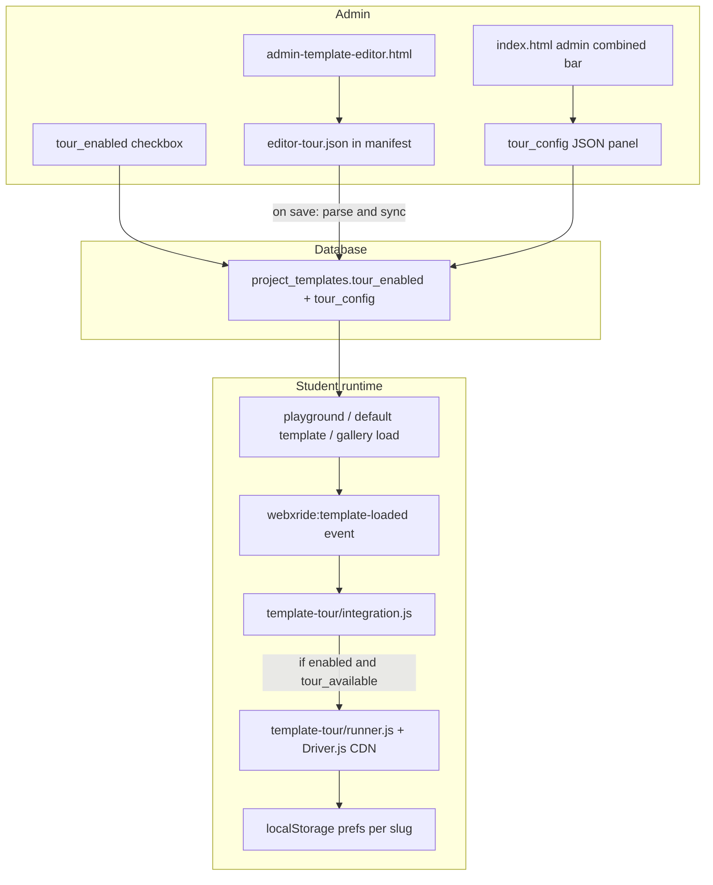

# Template Guided Tour (isolated, optional, rollback-friendly)

**Target release:** 3.5  
**Status:** Planned — not implemented  
**Branch:** `3.5`

## Goals

- Admins can enable a tour per template and define popover steps (title, body, target selector, position).
- Tours are **optional for students**: soft prompt on first visit, dismissible, replayable from Help.
- Templates **without** a tour behave exactly as today (no UI, no Driver.js load).
- Support **flat** (`files_manifest`) and **combined** (bundle ZIP) templates from v1.
- **Easy back-out**: one feature flag, one folder, thin integration hooks, additive DB columns.

## Architecture



### Isolation strategy (rollback-first)

| Principle | Implementation |
|-----------|----------------|
| Kill switch | `template-tour/feature-flag.js` exports `TEMPLATE_TOUR_ENABLED` (default `false` until QA passes). All public entry points return immediately when false. |
| Self-contained code | New folder `template-tour/` only — no tour logic sprinkled in `script.js` beyond zero or one event dispatch. |
| Thin integration | Single adapter `template-tour/integration.js` with `onTemplateLoaded(template)` and `bindAdminTourUi(ctx)`. Core files add **one line** each. |
| Optional dependency | Driver.js loaded **dynamically from CDN** only when a tour actually starts — not bundled into `flat-editor.bundle.js`. |
| Additive schema | New nullable DB columns; existing rows unaffected. |
| Rollback doc | `template-tour/ROLLBACK.md` lists every hook, file, migration, and script tag to remove. |

**To disable without deleting code:** set `TEMPLATE_TOUR_ENABLED = false` in `feature-flag.js` and redeploy.

**To remove entirely:** delete `template-tour/`, remove script tag + grep for `onTemplateLoaded` / `bindAdminTourUi`, leave DB columns unused (harmless).

---

## Data model

### DB migration (`db/migrate.js`)

Add to `project_templates`:

- `tour_enabled BOOLEAN NOT NULL DEFAULT FALSE`
- `tour_config JSONB` (nullable)

Update `lib/templates.js` `mapRow`, `createTemplate`, `updateTemplate` to read/write both fields.

**Canonical tour source for students:** DB columns only (not parsed from ZIP at runtime).

### `tour_config` JSON schema (v1)

```json
{
  "version": 1,
  "title": "Getting started",
  "intro": "Optional one-line summary for the soft prompt",
  "steps": [
    {
      "id": "hotspot-type",
      "target": "#hotspot-type-section",
      "title": "Choose a hotspot type",
      "body": "Text, audio, portal, and more.",
      "side": "left",
      "prepare": ["openEditorPanel"]
    }
  ]
}
```

**Tour is offered** when: `tour_enabled === true` AND `steps.length > 0` AND feature flag on.

Validation on admin save (`template-tour/validate.js`): required fields, allowed `prepare` actions, selector syntax check (no `..`).

### Flat vs combined authoring

| Template scope | Where admin edits steps | Saved to |
|----------------|-------------------------|----------|
| **flat** | `editor-tour.json` in template file tree (admin-only, mirrors `config.ui.json` pattern) | Parsed on save → `tour_config` column |
| **combined** | JSON panel in admin combined bar (`admin-combined-template.js`) or templates list card | `tour_config` column directly (not inside bundle ZIP) |

On flat template save (`admin-template-editor.js`): read `editor-tour.json` from `bridge.getTemplateFilesManifest()`, validate, write to `tour_config`; warn if `tour_enabled` but zero steps.

Extend `lib/template-manifest.js`:

- Add `editor-tour.json` to `ADMIN_ONLY_TEMPLATE_FILES` (strip from student `files_manifest`, same as `config.ui.json`).
- Student API still returns `tour_config` from DB (not from manifest at runtime).

Extend `flat-editor/file-utils.js` `ADMIN_ONLY_FILE_IDS` with `editor-tour.json`.

Ship a starter file `template-tour/editor-tour.example.json` admins can copy.

---

## Student runtime

### New module files (`template-tour/`)

| File | Role |
|------|------|
| `feature-flag.js` | Global on/off |
| `validate.js` | Parse + validate `tour_config` |
| `prefs.js` | `localStorage` keyed by `template.slug` + `tour_config.version` (`dismissed` / `completed`) |
| `prepare-actions.js` | Named prep: `openEditorPanel`, `scrollTargetIntoView`, `focusConfigVisual` |
| `runner.js` | Dynamic Driver.js load, step mapping, onDestroyed → save prefs |
| `student-ui.js` | Soft banner + “Take guided tour” link near `#instructions-toggle-btn` |
| `integration.js` | `onTemplateLoaded({ slug, tour_enabled, tour_config })` — orchestrates UI + runner |
| `driver-theme.css` | Minimal dark theme matching editor greens |

### Load entry points (one line each)

```js
window.TemplateTourIntegration?.onTemplateLoaded(template);
```

Add to:

- `playground-templates-ui.js` `runPendingPlaygroundLoad` (after flat or combined ZIP load)
- `flat-editor/main.jsx` after default template load
- `flat-editor/FlatPageEditorUI.jsx` template gallery `onLoad`

Guard with optional chaining so missing script = no-op.

### Student UX flow

1. Template loads with `tour_enabled` + valid `tour_config`.
2. If prefs say not dismissed/completed (or `version` bumped): show **non-blocking banner** — “Take a short guided tour?” [Start] [Not now].
3. **Not now** / **Skip tour** → `dismissed`, banner hidden; editor unaffected.
4. **Take guided tour** always available in instructions area.
5. Tour uses Driver.js spotlight on **editor chrome** targets. v1 is editor-focused; `scope: "preview"` reserved for later.
6. Skip auto-start on embed mode (`window.__vrTourEmbedMode`).

### API changes

Include `tour_enabled` and `tour_config` on student template payloads:

- `routes/playground-routes.js` `GET /api/playground/templates/:slug`
- `routes/template-routes.js` `GET /api/templates/default`, `GET /api/templates/:slug`
- `lib/templates.js` `templateForStudent` helper or inline in routes

---

## Admin UI

### Flat template editor (`admin-template-editor.html` + `admin-template-editor.js`)

- Checkbox: **Enable guided tour** (`#tpl-tour-enabled`) next to Public / Playground flags.
- Collapsible **Guided tour** panel (v1 = JSON textarea bound to `editor-tour.json`).
- **Preview tour** button (admin only).
- Save payload adds `tour_enabled` + parsed `tour_config`.

### Combined template editor (`admin-combined-template.js`)

- Tour checkbox + JSON textarea in `#admin-combined-bar`.
- On **Save to Welcome Sample**: PATCH `tour_enabled` + `tour_config` alongside bundle upload.

### Script loading

- `index.html`: `<script src="template-tour/integration.js">`
- `admin-template-editor.html`: same + `bindAdminTourUi` on `flat-editor-ready`.

**Do not** modify `script.js` body for tour logic.

---

## Stable tour targets (v1 catalog)

- `#content-mode-spherical`, `#content-mode-flat`
- `#hotspot-type-section`, `#add-hotspot`
- `#set-starting-point`, `#current-scene`
- `#edit-mode-toggle`, `#instructions-toggle-btn`
- `a-scene` (canvas highlight for placement step)

---

## Phased delivery

### Phase 1 (ship behind flag)

- DB columns + API
- `template-tour/` module + kill switch
- Flat admin: checkbox + JSON panel + `editor-tour.json`
- Combined admin: checkbox + JSON in combined bar
- Student: soft prompt + replay link + Driver.js runner
- `ROLLBACK.md` + example JSON
- One sample template tour for QA

### Phase 2 (defer)

- Visual step builder (reorder, pick-on-page)
- `tour_enabled` toggle on templates list
- `app_settings` runtime override for kill switch
- Preview-scope steps inside flat preview iframe

---

## Implementation checklist

- [ ] Create `template-tour/` folder (feature-flag, validate, prefs, prepare-actions, runner, student-ui, integration.js, driver-theme.css, editor-tour.example.json, ROLLBACK.md)
- [ ] Add `tour_enabled` + `tour_config` migration; update `lib/templates.js` and student API routes
- [ ] Add `editor-tour.json` to ADMIN_ONLY sets; sync flat save in `admin-template-editor.js`
- [ ] Flat admin UI + combined admin UI
- [ ] Student hooks in loaders + script tag in `index.html`
- [ ] Soft banner, prefs, replay link
- [ ] Example tour on one flat + one combined template; QA with flag on/off

---

## Testing checklist

- Feature flag `false`: zero UI, zero Driver CDN, unchanged template load.
- `tour_enabled: false`: no student tour UI.
- `tour_enabled: true` but empty steps: no UI; admin save warning.
- Flat playground: banner → Start → Complete → no re-prompt.
- Dismiss → no banner; replay link still works.
- Bump `tour_config.version` → banner shows once more.
- Combined bundle load uses DB `tour_config`.
- Admin preview does not write student prefs.
- Collapsed `#hotspot-editor`: `prepare: openEditorPanel` works.
- z-index above panels, below admin dialogs.

---

## Rollback procedure

1. Set `TEMPLATE_TOUR_ENABLED = false` (instant).
2. To remove code: delete `template-tour/`, remove script tags, remove `onTemplateLoaded` hooks, revert admin UI and manifest changes, rebuild flat-editor bundle if needed.
3. DB columns can remain dormant.
